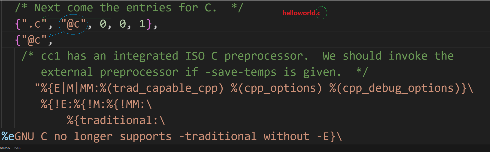
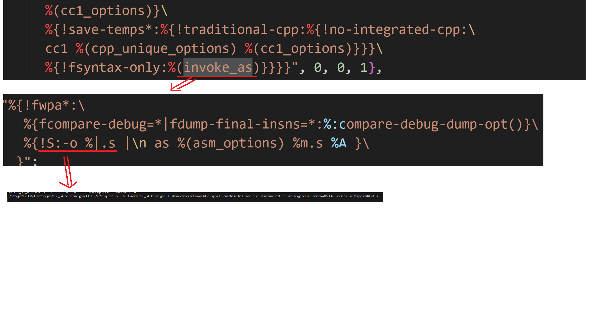

# 如何选择编译器？
## 根据源文件的后缀名选择
- 根据源文件后缀名从支持的列表中查询相应的编译器


```c
// gcc/gcc.cc
static struct compiler *
lookup_compiler (const char *name, size_t length, const char *language)
{
  struct compiler *cp;

  /* If this was specified by the user to be a linker input, indicate that.  */
  if (language != 0 && language[0] == '*')
    return 0;

  /* Otherwise, look for the language, if one is spec'd.  */
  if (language != 0)
    {
      for (cp = compilers + n_compilers - 1; cp >= compilers; cp--)
	if (cp->suffix[0] == '@' && !strcmp (cp->suffix + 1, language))
	  {
	    if (name != NULL && strcmp (name, "-") == 0
		&& (strcmp (cp->suffix, "@c-header") == 0
		    || strcmp (cp->suffix, "@c++-header") == 0)
		&& !have_E)
	      fatal_error (input_location,
			   "cannot use %<-%> as input filename for a "
			   "precompiled header");

	    return cp;
	  }

      error ("language %s not recognized", language);
      return 0;
    }

  /* Look for a suffix.  */
  for (cp = compilers + n_compilers - 1; cp >= compilers; cp--)
    {
      if (/* The suffix `-' matches only the file name `-'.  */
	  (!strcmp (cp->suffix, "-") && !strcmp (name, "-"))
	  || (strlen (cp->suffix) < length
	      /* See if the suffix matches the end of NAME.  */
	      && !strcmp (cp->suffix,
			  name + length - strlen (cp->suffix))
	 ))
	break;
    }
    
    ...

  if (cp >= compilers)
    {
      if (cp->spec[0] != '@')
	/* A non-alias entry: return it.  */
	return cp;

      /* An alias entry maps a suffix to a language.
	 Search for the language; pass 0 for NAME and LENGTH
	 to avoid infinite recursion if language not found.  */
      return lookup_compiler (NULL, 0, cp->spec + 1);
    }
  return 0;
}
```

# 编译器列表从何而来？
`driver::main -> driver::set_up_specs 初始化支持的编译器列表`

```c
// gcc/gcc.cc
/* The default list of file name suffixes and their compilation specs.  */

static const struct compiler default_compilers[] =
{
  /* Add lists of suffixes of known languages here.  If those languages
     were not present when we built the driver, we will hit these copies
     and be given a more meaningful error than "file not used since
     linking is not done".  */
  ...
  {".cc", "#C++", 0, 0, 0}, {".cxx", "#C++", 0, 0, 0},
  {".cpp", "#C++", 0, 0, 0}, {".cp", "#C++", 0, 0, 0},
  {".c++", "#C++", 0, 0, 0}, {".C", "#C++", 0, 0, 0},
  {".CPP", "#C++", 0, 0, 0}, {".ii", "#C++", 0, 0, 0},
  ...
  /* Next come the entries for C.  */
  {".c", "@c", 0, 0, 1},
  {"@c",
   /* cc1 has an integrated ISO C preprocessor.  We should invoke the
      external preprocessor if -save-temps is given.  */
     "%{E|M|MM:%(trad_capable_cpp) %(cpp_options) %(cpp_debug_options)}\
      %{!E:%{!M:%{!MM:\
          %{traditional:\
%eGNU C no longer supports -traditional without -E}\
      %{save-temps*|traditional-cpp|no-integrated-cpp:%(trad_capable_cpp) \
	  %(cpp_options) -o %{save-temps*:%b.i} %{!save-temps*:%g.i} \n\
	    cc1 -fpreprocessed %{save-temps*:%b.i} %{!save-temps*:%g.i} \
	  %(cc1_options)}\
      %{!save-temps*:%{!traditional-cpp:%{!no-integrated-cpp:\
	  cc1 %(cpp_unique_options) %(cc1_options)}}}\
      %{!fsyntax-only:%(invoke_as)}}}}", 0, 0, 1},
  {"-",
   "%{!E:%e-E or -x required when input is from standard input}\
    %(trad_capable_cpp) %(cpp_options) %(cpp_debug_options)", 0, 0, 0},
  {".h", "@c-header", 0, 0, 0},
  {"@c-header",
   /* cc1 has an integrated ISO C preprocessor.  We should invoke the
      external preprocessor if -save-temps is given.  */
     "%{E|M|MM:%(trad_capable_cpp) %(cpp_options) %(cpp_debug_options)}\
      %{!E:%{!M:%{!MM:\
	  %{save-temps*|traditional-cpp|no-integrated-cpp:%(trad_capable_cpp) \
		%(cpp_options) -o %{save-temps*:%b.i} %{!save-temps*:%g.i} \n\
		    cc1 -fpreprocessed %{save-temps*:%b.i} %{!save-temps*:%g.i} \
			%(cc1_options)\
			%{!fsyntax-only:%{!S:-o %g.s} \
			    %{!fdump-ada-spec*:%{!o*:--output-pch %i.gch}\
					       %W{o*:--output-pch %*}}%V}}\
	  %{!save-temps*:%{!traditional-cpp:%{!no-integrated-cpp:\
		cc1 %(cpp_unique_options) %(cc1_options)\
		    %{!fsyntax-only:%{!S:-o %g.s} \
		        %{!fdump-ada-spec*:%{!o*:--output-pch %i.gch}\
					   %W{o*:--output-pch %*}}%V}}}}}}}", 0, 0, 0},
  {".i", "@cpp-output", 0, 0, 0},
  {"@cpp-output",
   "%{!M:%{!MM:%{!E:cc1 -fpreprocessed %i %(cc1_options) %{!fsyntax-only:%(invoke_as)}}}}", 0, 0, 0},
  {".s", "@assembler", 0, 0, 0},
  {"@assembler",
   "%{!M:%{!MM:%{!E:%{!S:as %(asm_debug) %(asm_options) %i %A }}}}", 0, 0, 0},
  {".sx", "@assembler-with-cpp", 0, 0, 0},
  {".S", "@assembler-with-cpp", 0, 0, 0},
  {"@assembler-with-cpp",
#ifdef AS_NEEDS_DASH_FOR_PIPED_INPUT
   "%(trad_capable_cpp) -lang-asm %(cpp_options) -fno-directives-only\
      %{E|M|MM:%(cpp_debug_options)}\
      %{!M:%{!MM:%{!E:%{!S:-o %|.s |\n\
       as %(asm_debug) %(asm_options) %|.s %A }}}}"
#else
   "%(trad_capable_cpp) -lang-asm %(cpp_options) -fno-directives-only\
      %{E|M|MM:%(cpp_debug_options)}\
      %{!M:%{!MM:%{!E:%{!S:-o %|.s |\n\
       as %(asm_debug) %(asm_options) %m.s %A }}}}"
#endif
   , 0, 0, 0},

#include "specs.h"
  /* Mark end of table.  */
  {0, 0, 0, 0, 0}
};

/* Number of elements in default_compilers, not counting the terminator.  */

static const int n_default_compilers = ARRAY_SIZE (default_compilers) - 1;

void
driver::set_up_specs () const
{
    ...

  /* Initialize the vector of specs to just the default.
     This means one element containing 0s, as a terminator.  */

  compilers = XNEWVAR (struct compiler, sizeof default_compilers);
  memcpy (compilers, default_compilers, sizeof default_compilers);
  n_compilers = n_default_compilers;
    ...
}
```

# 如何调用具体的编译程序？
## 通过解析spec语言
- 解析筛选到的编译器中的spec信息，调用具体的编译器程序



```c
// gcc/gcc.cc
static int
execute (void)
{
    ...
    // 1. 构建命令
    ...
    // 2. 初始化执行环境
    pex = pex_init (PEX_USE_PIPES | ((report_times || report_times_to_file)
				   ? PEX_RECORD_TIMES : 0),
    // 3. 执行命令
    for (i = 0; i < n_commands; i++)
    {
      const char *errmsg;
      int err;
      const char *string = commands[i].argv[0];

      errmsg = pex_run (pex,
			((i + 1 == n_commands ? PEX_LAST : 0)
			 | (string == commands[i].prog ? PEX_SEARCH : 0)),
			string, CONST_CAST (char **, commands[i].argv),
			NULL, NULL, &err);
      ...
    }

    // 4. 等待命令结束，并获取执行结果
    int *statuses;
    ...
    statuses = XALLOCAVEC (int, n_commands);
    pex_get_status (pex, n_commands, statuses);
    ...
    for (i = 0; i < n_commands; ++i)
      {
	int status = statuses[i];

      }
   ...
}
```
```c
// libiberty/pex-common.c
const char *
pex_run (struct pex_obj *obj, int flags, const char *executable,
       	 char * const * argv, const char *orig_outname, const char *errname,
         int *err)
{
  return pex_run_in_environment (obj, flags, executable, argv, NULL,
				 orig_outname, errname, err);
}

const char *
pex_run_in_environment (struct pex_obj *obj, int flags, const char *executable,
       	                char * const * argv, char * const * env,
                        const char *orig_outname, const char *errname,
                  	int *err)
{
    ...
    pid = obj->funcs->exec_child (obj, flags, executable, argv, env,
				in, out, errdes, toclose, &errmsg, err);
    ...
}
```

```c
// libiberty/pex-unix.c
pex_unix_exec_child (struct pex_obj *obj, int flags, const char *executable,
		     char * const * argv, char * const * env,
                     int in, int out, int errdes,
		     int toclose, const char **errmsg, int *err)
{
    ...
    pipe2 ((int *)pipes, O_CLOEXEC)
    ...
    pid = vfork ();
    ...
    switch (pid) {
    case -1: // vfork error
        ...
        break;
    case 0: // child
        ...
        execvp (executable, to_ptr32 (argv));
        ...
        break;
    default: // parent
        break;
    }
}
```